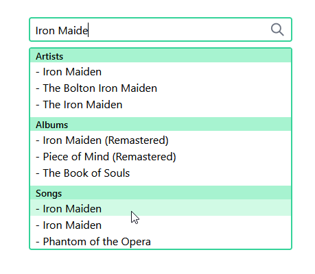

# music-library

[Comgy](https://comgy.io/en/) Coding Challenge: Frontend &amp; API

The goal was to write a frontend web app that allows search through a music library and offers a rich and modern UI/UX.
iTunes was suggested for the library search functionality, since it does not require any API key or similar.

I used Nuxt, Axios and TailwindCSS to complete the coding challenge.




## Getting Started

These instructions will get you a copy of the project up and running on your local machine for development and testing purposes. After cloning the repository, you can install the dependencies and run a development server or build the project.

```bash
# install dependencies
$ npm install

# serve with hot reload at localhost:3000
$ npm run dev

# build for production and launch server
$ npm run build
$ npm run start

# generate static project
$ npm run generate
```

## Authors

- **Tobias Klatt** - _Initial work_ - [GitHub](https://github.com/T0biWan/)
